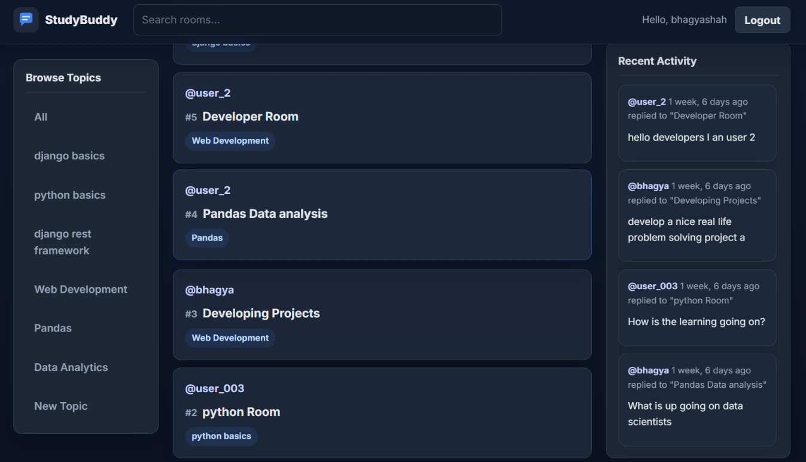
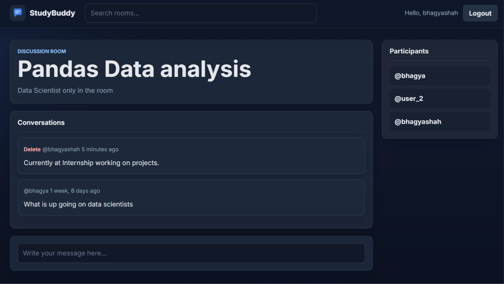
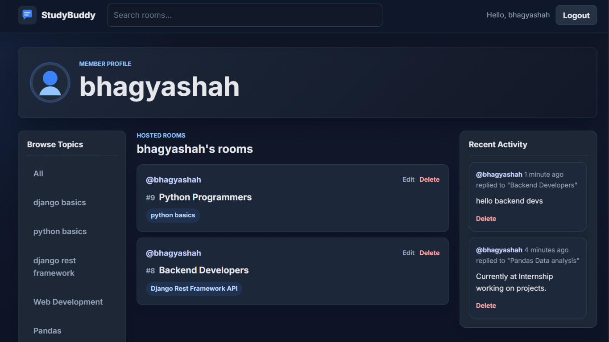

# StudyBud

StudyBud is a Django-based web application where users can create and join study rooms on various topics, engage in discussions, and collaborate with other learners.

This project was built during my internship while learning Django and full-stack web development. It was developed over the span of a month as a hands-on project to strengthen my understanding of Django, database relationships, and backend development concepts. [static files i.e. frontend(css,images,js) nmbycdx]

## Reference

- This project was built while learning Django from Dennis Ivy through the [Django Youtube Course](https://www.youtube.com/watch?v=PtQiiknWUcI&t=14846s).
- The project was inspired by [StudyBud GitHub Repo](https://github.com/Traversy-Media/StudyBud).

## Screenshots

  
  
  

## Features

- User Authentication
- Rooms
- Activity Feed
- User Profile Page
- Topics
- Messages
- CRUD Operations

## Run Locally

git clone <repo-url>

pip install -r requirements.txt

python manage.py runserver